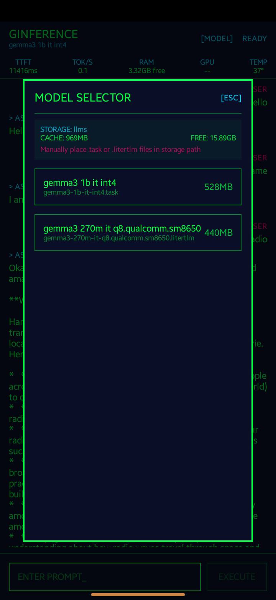
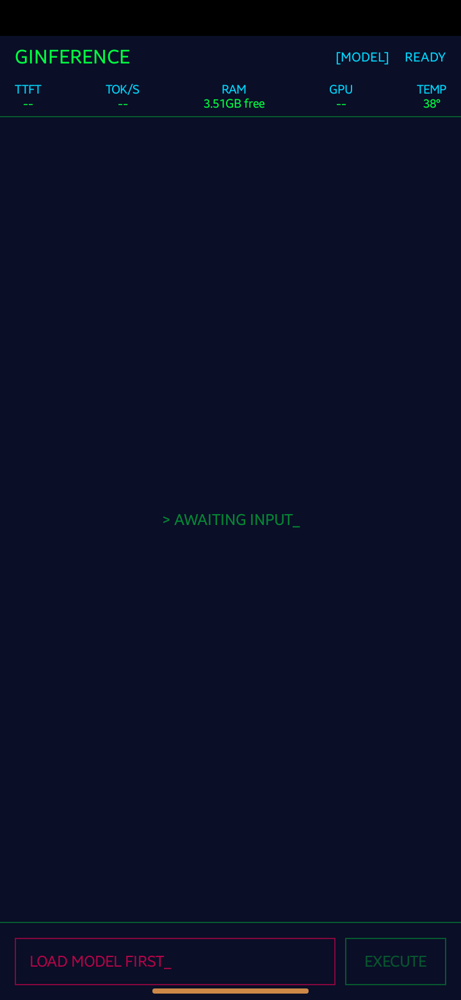
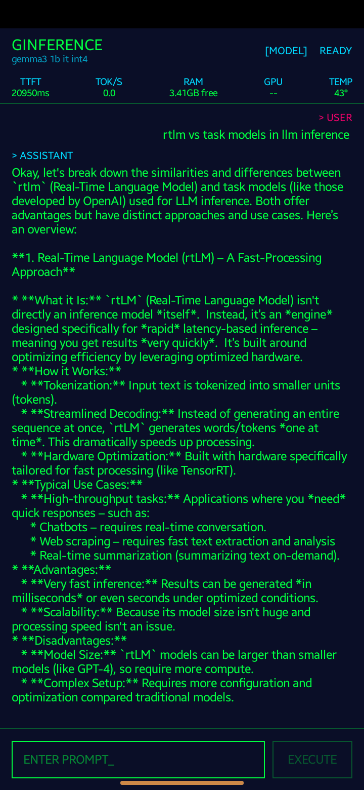

# GINFERENCE

**Local LLM Inference on Android** - A cyberpunk terminal-style app for running large language models completely on-device using MediaPipe.

<p align="center">
  
  
  
</p>

## Features

- 🎨 **Cyberpunk Terminal UI** - Matrix green/cyan neon aesthetic with retro vibes
- 🤖 **On-Device LLM** - No internet required, runs completely locally
- 📊 **Real-time Metrics** - TTFT, tokens/sec, RAM, GPU, temperature
- 💬 **Streaming Output** - Token-by-token text generation
- 📁 **Flexible Model Loading** - Pick any folder with Storage Access Framework
- ⚡ **GPU Accelerated** - Uses MediaPipe LLM Inference with GPU delegate

## Quick Start

### 1. Download APK

Get the latest release from [GitHub Releases](https://github.com/MukundKal/ginference/releases)

```bash
adb install ginference-v0.9.0-beta.apk
```

### 2. Download a Model

**⚠️ IMPORTANT: Only `.task` files are supported. Do NOT use `.litertlm` files.**

Recommended models from [HuggingFace litert-community](https://huggingface.co/litert-community):

| Model | Size | Link |
|-------|------|------|
| Gemma3-1B-IT (int4) | 555 MB | [Download](https://huggingface.co/litert-community/Gemma3-1B-IT/resolve/main/gemma3-1b-it-int4.task) |
| Gemma3-1B-IT (q8) | 1 GB | [Download](https://huggingface.co/litert-community/Gemma3-1B-IT/resolve/main/Gemma3-1B-IT_multi-prefill-seq_q8_ekv2048.task) |
| SmolLM-135M | 167 MB | [Download](https://huggingface.co/litert-community/SmolLM-135M-Instruct/resolve/main/SmolLM-135M-Instruct_multi-prefill-seq_q8_ekv1280.task) |

> Note: Gemma models require accepting the license on HuggingFace first.

### 3. Push Model to Device

```bash
# Create folder on device
adb shell mkdir -p /sdcard/llms

# Push model file
adb push gemma3-1b-it-int4.task /sdcard/llms/
```

### 4. Run the App

1. Open ginference
2. Tap **[MODEL]** button
3. Select the folder containing your models
4. Tap a model to load it
5. Start chatting!

## Requirements

- Android 8.0+ (SDK 26+)
- ~1GB free RAM for small models
- ~2GB free RAM for larger models
- GPU recommended (Snapdragon 8 Gen 1+ for best performance)

## Tech Stack

```
ginference App (Kotlin + Jetpack Compose)
        ↓
MediaPipe LLM Inference API (0.10.27)
        ↓
LiteRT Runtime + GPU Delegate
        ↓
Android NNAPI / Vulkan
        ↓
Device GPU (Adreno/Mali/etc)
```

## Known Issues

### ❌ `.litertlm` Files Not Supported

MediaPipe tasks-genai does NOT support the RTLM format (`.litertlm` files).

**Error:** `Model provided has model identifier 'RTLM', should be 'TFL3'`

**Solution:** Use `.task` files instead.

### ⚠️ Memory Requirements

Large models may fail to load on devices with limited RAM. Try:
- Closing other apps
- Using a smaller/quantized model (int4 instead of fp32)
- Restarting the device

## Building from Source

```bash
# Clone the repository
git clone https://github.com/MukundKal/ginference.git
cd ginference

# Build debug APK
./gradlew assembleDebug

# Install to connected device
adb install -r app/build/outputs/apk/debug/app-debug.apk
```

## Project Structure

```
ginference/
├── app/src/main/kotlin/com/ginference/
│   ├── MainActivity.kt
│   ├── ui/
│   │   ├── theme/Theme.kt          # Cyberpunk colors
│   │   ├── screens/InferenceScreen.kt
│   │   └── components/ModelSelector.kt
│   ├── inference/
│   │   ├── LLMEngine.kt            # MediaPipe wrapper
│   │   └── ModelManager.kt         # Folder scanning
│   ├── metrics/
│   │   └── SystemMetrics.kt        # RAM/GPU/temp monitoring
│   └── viewmodels/
│       └── InferenceViewModel.kt
├── screenshots/                     # Demo images
├── PLAN.md                         # Development roadmap
└── README.md                       # This file
```

## UI Theme

**Color Palette:**
- Background: `#0A0E27` (deep space blue-black)
- Primary: `#00FF41` (matrix green)
- Secondary: `#00D9FF` (cyan neon)
- Accent: `#FF006E` (hot pink)
- Warning: `#FFD60A` (yellow)
- Error: `#FF0055` (red neon)

## Contributing

Contributions welcome! Please check the [PLAN.md](PLAN.md) for the current development status and roadmap.

## License

MIT License - See [LICENSE](LICENSE) for details.

## Acknowledgments

- [MediaPipe](https://developers.google.com/mediapipe) - On-device ML framework
- [LiteRT Community](https://huggingface.co/litert-community) - Pre-converted model weights
- [Google Gemma](https://ai.google.dev/gemma) - Open weights LLM

---

**Made with 💚 for on-device AI**